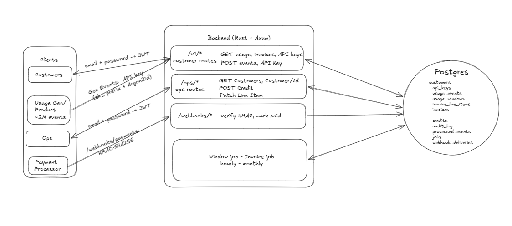
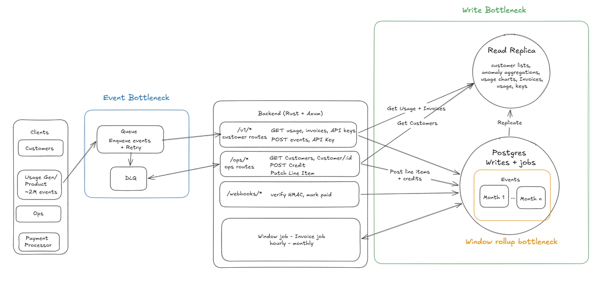

# DESIGN.md

I treated this as a v1. Someone walks in and says "we have a demo next week, ship the billing system." I favored high consistency over everything else: no dropped events, no double billing, no audit gaps.

---

## 1. Data model

The schema has twelve tables. Core chain: `customers` → `api_keys` → `usage_events` → `usage_windows` → `invoice_line_items` → `invoices`. Supporting tables handle idempotency, ops access, and observability.

Key tables:

- `usage_events`: `request_id TEXT UNIQUE` is the idempotency key, enforced at the DB level, one row per external event. `units BIGINT CHECK (units > 0)` prevents zero or negative billing. `status` tracks late arrivals.
- `usage_windows`: `UNIQUE (customer_id, window_start)` makes upserts deterministic. The aggregation job can run twice and land in the same row.
- `invoices`: `UNIQUE (customer_id, period_start)` prevents double-invoicing a month.
- `credits`: `idempotency_key TEXT UNIQUE` stops double-clicks from ops from issuing duplicate credits.
- `audit_log`: `actor_email` is denormalized so records survive ops user deletion. Immutability is enforced by Postgres triggers, not application code (see section 5).
- `processed_events`: a separate idempotency table, not a flag on `usage_events`, so the dedup check runs before the insert with no read-then-check race.
- `jobs`: a lock table used with `SKIP LOCKED` for job coordination.
- `webhook_deliveries`: delivery-ID dedup for payment webhooks.

Indexes:

- `(customer_id, timestamp)` on `usage_events`: the primary read pattern for the window job and `/v1/usage`. Almost everything goes through this.
- `(customer_id, window_start)` on `usage_windows`: the invoice job reads per-customer per-hour.
- `prefix` on `api_keys`: auth narrows to one row via prefix before running Argon2. Without this index, auth scans the whole table on every request.
- `(customer_id, period_start DESC)` on `invoices`: customer portal lists invoices newest-first.
- `resolved_at WHERE resolved_at IS NULL` partial index on `anomaly_flags`: ops only queries open anomalies, so the index skips all resolved ones.

At 10x load (roughly 50M events/month): add a BRIN index on `usage_events(timestamp)` for range-scan efficiency and partition `usage_events` by month. Old partitions become read-only and can be archived cheaply.

At 100x (the 500M events/month production target): partition `usage_events` by `(customer_id hash, month)` so the window job parallelizes across shards. Add a read replica and route all reads there. Simple rule: writes go to the primary, everything else goes to the replica. This removes read pressure from the write path entirely and gives the jobs and event ingest more room on the primary.

---

## 2. Idempotency and concurrency

Four scenarios that had to hold:

**Event ingestion replay.** `POST /v1/events` runs `INSERT INTO processed_events (request_id) ON CONFLICT DO NOTHING` before touching `usage_events`. If the request_id is already present, the event is skipped and the response returns 200. The two-table design means the dedup gate is a single keyed write with no read-then-check race. Concurrent ingestion of the same request_id races to `processed_events`; only one wins.

**Aggregator running twice.** The window job acquires a row lock on `jobs WHERE job_type = 'window'` using `SELECT FOR UPDATE SKIP LOCKED`. A second instance finds zero rows and exits. The window update uses `INSERT ... ON CONFLICT (customer_id, window_start) DO UPDATE SET units_total = EXCLUDED.units_total`, which overwrites with the freshly computed total. Safe to replay because the result is always derived from the same source events.

**Webhook delivered three times.** `POST /webhooks/payments` runs `INSERT INTO webhook_deliveries (delivery_id) ON CONFLICT DO NOTHING`. If the delivery ID is already present, the handler returns 200 with no side effects. Signature verification runs before the dedup check, so unsigned requests never reach it.

**Ops double-clicking "issue credit".** The ops client generates a UUID idempotency key when the dialog opens and sends it in the request body. The `credits.idempotency_key` column has a `UNIQUE` constraint. A second identical request hits `ON CONFLICT DO NOTHING` and returns the existing credit row. The key is held for the lifetime of the dialog, not regenerated on each click.

---

## 3. Aggregation pipeline

The window job runs hourly. It's a full recompute: `SELECT customer_id, date_trunc('hour', timestamp), SUM(units) FROM usage_events WHERE status = 'normal' GROUP BY ...` upserted into `usage_windows` with `ON CONFLICT DO UPDATE SET units_total = EXCLUDED.units_total`. Intentionally a full scan, not incremental. Each run is slower, but the result is always correct. Late events and retries land automatically on the next run, no bookkeeping required. At current scale this is fine; at 500M events/month the fix is partitioning, not incrementalism (see section 4).

The invoice job runs monthly. It reads `usage_windows` for the billing period, applies tiered pricing from `price_plans` (tiers stored as JSONB, plan pinned at period start), and writes `invoice_line_items` and an `invoice` row. The invoice job writes invoices directly as `issued`; the `draft` status exists for invoices created manually outside the job.

Windows are recomputable. Invoices in `issued` or `paid` state are not. The invoice job skips any customer that already has a non-draft invoice for that period. Line-item overrides are soft: `overridden_at` gets set and the new value is written, but the originals stay in the audit log.

Late-arriving events are written with `status = 'late'` and excluded from the current window. The delta posts as a credit on the next open invoice. Closed invoices are never reopened.

To check for drift: `SUM(units) FROM usage_events WHERE customer_id = $1 AND timestamp BETWEEN $start AND $end` vs `SUM(units_total) FROM usage_windows` for the same range. A gap means late events or a job that hasn't run yet. Rerunning the job is always safe.

---

## 4. Failure modes

**Single Postgres write node.** Right now all of these hit one DB instance: event ingestion, idempotency checks, window upserts, job locks. That's the main bottleneck. Fix in order: (1) read replica for all reads. Writes go to primary, everything else goes to the replica. Replica lag means a customer might not see a newly created API key immediately. In practice it doesn't matter. They copy the key into their env before making any requests, which takes longer than replication. (2) Partition `usage_events` by customer_id hash if per-partition write throughput becomes the constraint after that.

**Event ingest write path.** `POST /v1/events` writes synchronously to Postgres. At 2,000 events/sec this is fine; at 10x the write path backs up and events start dropping. Fix: queue (Kafka or SQS) between the product and the backend. The product enqueues and moves on. A consumer delivers to the backend with retries, spitting to a DLQ after exhausting them. DLQ events need human review: persistent failure usually means something structurally wrong. Replay is safe because `request_id` idempotency handles duplicate delivery.

**Aggregation job performance.** The window job does a full table scan every hour: `SUM(units) GROUP BY customer_id, hour` across all of `usage_events`. At 500M events/month that's roughly 16M rows per day on every run. Fix: partition `usage_events` by month. Each run scans only the current partition. The `(customer_id, timestamp)` index handles grouping within it. Incrementalism (`WHERE timestamp >= last_run_at`) drifts when events arrive late or jobs crash mid-run; partitioning solves the performance problem without giving that up.

---

## 5. Threat model

**Hostile customer**

The obvious attack is guessing another customer's UUID and reading their invoices or usage.

Tenant scoping is enforced at the extractor level, not in individual handlers. The `CustomerSession` extractor resolves the API key to a `customer_id` and attaches it to the request. Every query binds `customer_id = $1` from the extractor. There's no handler that fetches by ID alone. A valid UUID belonging to a different customer returns 404, same as a wrong UUID.

API keys are generated as `sk_<32 random bytes base64>`. An 8-character prefix is stored in plaintext to narrow the Argon2 verification to one row; the rest is hashed with Argon2id. The secret is shown once at creation and never again. A DB dump leaks prefixes, not secrets.

**Hostile internal user**

The realistic abuse case: an ops user issues an inflated credit to a customer they have a personal relationship with, or shaves a line item to undercharge.

Every credit issuance and line-item override writes to `audit_log` with `actor_id`, `actor_email`, `before_val`, `after_val`, and `reason`. The audit log is append-only via a Postgres trigger that raises an exception on any `UPDATE` or `DELETE`. This isn't a convention someone could forget. The trigger sits in the database, outside any application code path. An ops user can issue a credit; they can't erase it.

Double credit is blocked by the `idempotency_key` unique constraint on `credits`. A second click on the same dialog returns the existing credit row. The UI holds the key for the lifetime of the dialog.

**Compromised webhook source**

The risk is a replayed or forged payment webhook marking invoices paid without actual payment.

The endpoint verifies an HMAC-SHA256 signature against a shared secret from the environment (not the repo). Unsigned or incorrectly signed requests are rejected before any business logic runs. After verification, `webhook_deliveries` deduplicates by delivery ID. A redelivered webhook finds its ID already present and returns 200 with no side effects. If an attacker can forge the signature, the shared secret is compromised and the answer is secret rotation, not code changes.

---

## 6. Trade-offs

**Cursor pagination vs. offset**

Usage events are written continuously. Offset pagination breaks when rows are inserted mid-page. Page 2 can skip rows that were on page 1 when the first request came in. Cursor pagination encodes the last-seen `(timestamp, id)` and queries `WHERE (timestamp, id) < ($cursor_ts, $cursor_id)`, which is stable regardless of concurrent inserts.

The cost: cursors are opaque to clients (can't jump to page N) and take a bit more to implement. For an API customers will integrate against programmatically, stable pagination is a correctness requirement. Offset would have been simpler and wrong.

**Job table with SKIP LOCKED vs. an external queue**

An external queue (Celery, RQ, Sidekiq) gives retries, dead-letter queues, and a monitoring UI. The cost is an additional service (Redis or RabbitMQ) with its own coordination and safety guarantees to manage.

A Postgres job table with `SKIP LOCKED` keeps it all in one place: the lock, the work, the last-run timestamp, all queryable SQL. For three jobs running hourly and monthly, an extra service isn't worth it. If job count or cadence grows, migration is straightforward: the job table becomes a queue table and the locking logic moves into the queue library.

---

## 7. Operational observability

**What to alert on.** The anomaly job writes five signals to `anomaly_flags`: usage 10× 30-day average, zero-usage drop, high-frequency `request_id` (retry loop), invoice spike vs. prior month, API key used from multiple IPs in a short window. The first two are worth waking someone up for — a spike or sudden zero usually means something broke in the customer's integration or the ingest pipeline. The rest go to the ops review queue.

**How to debug a wrong invoice.** Start with the drift check: `SUM(units) FROM usage_events WHERE customer_id = $1 AND timestamp BETWEEN $start AND $end` vs `SUM(units_total) FROM usage_windows` for the same range. A gap means late events or a job that didn't finish. Then check `audit_log` for any line-item overrides or credits in that period. If there's still drift, rerun the window job — it's always safe and it overwrites stale totals. If numbers still don't line up, what's left is late events with `status = 'late'`, which are intentionally excluded from the current window.

---

## 8. What wasn't built

**Event stream buffer.** `POST /v1/events` writes directly to Postgres. At 2,000 events/sec peak, a queue (Kafka or SQS) in front of ingestion is the standard buffer against spikes. It's purely additive: the consumer replaces the HTTP ingest path, nothing else changes.

**MFA for ops users.** Ops has email/password login, no second factor. The audit log records damage, it doesn't prevent it. The identity behind those entries matters. A compromised ops account can issue fraudulent credits that are logged but not stopped.

Next priorities: Kafka ingest buffer, monthly partitioning on `usage_events`, Redis dedup for the fast path, MFA for ops users.

### Some small things that were cut (for posterity)

- **Alerting**: anomaly flags surface in the console but nothing pages; would wire to PagerDuty
- **PDF invoices**: no download option; background job rendering to S3 is the next step
- **Multi-currency**: all amounts are USD minor units; adding currency is a schema change, not an architectural one
- **Password reset**: no reset flow; fine for a prototype, real auth service in production
